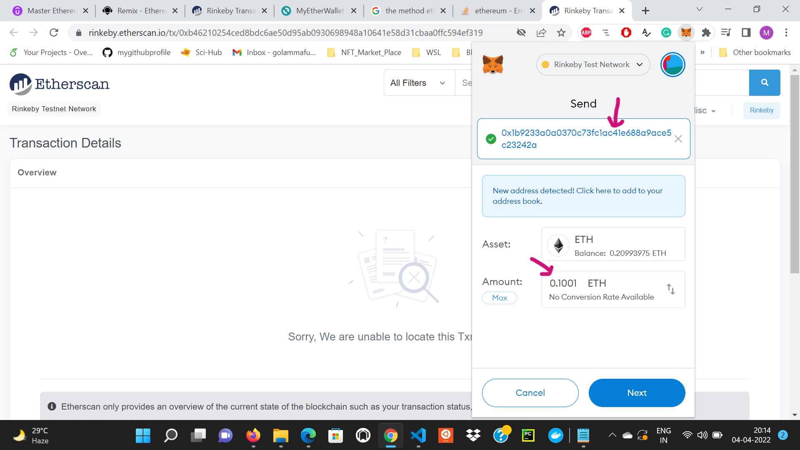

# ***Mastering-Solidity-Programming-from-Scratch***

Fundamentals of ***Solidity*** for ***Ethereum Blockchain***

<br/>

## ***Smart Contract ***Compilation******
<br/>


<br/>

* The Solidity source code is passed to the solidity compiler and the compile returns the
EVM bytecode that is deployed and the contract **ABI - Abstract Binary Interface**.
<br/>

* There are many solidity compilers available: Remix built-in compiler, solc, solcjs
<br/>

* Contract bytecode is public. It is saved on the Blockchain and can’t be encrypted because it must be run by every Ethereum node.
<br/>

* **Opcodes** are the human readable instructions of the program. They can be easily obtained from bytecode.
<br/>

* Contract source code doesn’t have to be public. Most contracts are public to build trust.
<br/>

* Anyone that wants to interact with the contract must have access to the contract ABI.
ABI is basically how you call functions in a contract and get data back.
<br/>

* ABI is list of contract’s function and arguments and it’s in JSON format. ABI is known at compile time.
<br/>

* ABI is generated from source code through compilation. If we don’t have the source code we can’t generate the contract ABI (or only from the bytecode using reverse engineering).
 
<br/>

## ***Solidity Data Types***
<br/>

Solidity is a statically-typed language (variables type should be specified at declaration). Data types are broken up into two main categories in Solidity:

* **Value types**

* **Reference types**
 
<br/>

### ***Value Types***
<br/>

1. ***Booleans***
 
In Solidity, `bool` stands for a Boolean value that is either `true` or `false`. You can do logical operations like “or,” “and,” “equal to,” “not equal to,” and so on, to get a Boolean value.

   * Boolean variables: `true` and `false`

   * Initialized by default with `false`
    
<br/>

2. ***Integers***

* Signed and Unsigned Integers of various sizes

* int8 to `int256`, `uint8` to `uint256` in steps of 8

* `int8` is between -128 and +127, int16 is between -32768 and +32767 and so on

* `int` is alias to `int256` and `uint` is an alias to `uint256`

* By default an int is initialized with zero

* There is no full support for float/double (fixed point numbers) in Solidity
 
<br/>

3. ***address***

While all the previously data types are common to other programming languages, the `address` data type is unique to Solidity. It's a 20-byte value that's used to represent an `address` on the Ethereum network. The address can be a user's Ethereum account or a contract deployed to the network. It has a `.balance()` **member** that can be called to check the balance associated with the account, and a `.transfer()` **member** that can be used to transfer funds to that address. There's also a `.send()` **member**, which is the low-level counterpart of the `.transfer()` **member**. If you use `.send()`, you must check the `return` value of the operation for success or failure, but if you're using .`transfer()`, the `transfer` member handles this for you automatically.

<br/>

> Please read about [SafeMath, Overflows and Underflows](https://peckshield.medium.com/alert-new-batchoverflow-bug-in-multiple-erc20-smart-contracts-cve-2018-10299-511067db6536).

<br/>

### ***Reference types***

<br/>

1. ***Solidity Arrays***

* **Fixed-Size Arrays**

   * Has a compile-time fixed size.

   * Can store any type (`int`, `uint`, `address`, `struct` etc)

   * bytes1, bytes2, …, bytes32 store a sequence of bytes.

   * Has **member** called `length`
 
<br/>

> **Coding: Fixed-Size Arrays**

```javascript
//SPDX-License-Identifier: GPL-3.0
 
pragma solidity >=0.5.0 <0.9.0;
 
contract FixedSizeArrays{
// declaring a fixed-size array of type uint with 3 elements
uint[3] public numbers = [2, 3, 4];
 
// declaring fixed-size arrays of type bytes
bytes1 public b1;
bytes2 public b2;
bytes3 public b3;
//.. up to bytes32
 
// changing an element of the array at a specific index
function setElement(uint index, uint value) public{
numbers[index] = value;
}
 
// returning the number of elements in the array
function getLength() public view returns(uint){
return numbers.length;
}
 
// setting bytes arrays
function setBytesArray() public{
b1 = 'a'; // => 0x61 (ASCII code of `a` in hex)
b2 = 'ab'; // => 0x6162
b3 = 'z'; // => 0x7A
// b3[0] = 'a'; // ERROR => can not change individual bytes
 
// byte is an alias for bytes1 on older code
}
}
 
```
<br/>

* **Dynamically-sized arrays**

  * `byte[ ]`
  
  * `byte[ ]` is an alias to `bytes`

  * `string` (UTF-8 encoding)

  * `uint[]`, `int[ ]`

  * **members**: `length` and `push`

> **Coding - Dynamic Arrays**

```javascript
//SPDX-License-Identifier: GPL-3.0
 
pragma solidity >=0.5.0 <0.9.0;
 
contract DynamicArrays{
// dynamic array of type uint
uint[] public numbers;
 
// returning length
function getLength() public view returns(uint){
return numbers.length;
}
 
// appending a new element
function addElement(uint item) public{
numbers.push(item);
}
 
// returning an element at an index
function getElement(uint i) public view returns(uint){
if(i < numbers.length){
return numbers[i];
}
return 0;
}
 
 
// removing the last element of the array
function popElement() public{
numbers.pop();
}
 
function f() public{
// declaring a memory dynamic array
// it's not possible to resize memory arrays (push() and pop() are not available).
uint[] memory y = new uint[](3);
y[0] = 10;
y[1] = 20;
y[2] = 30;
numbers = y;
}
 
}
```
<br/>


2. ***Strings***
   
In Solidity, a string is a type passed by reference. The string data type is used for arbitrary-length UTF-8 and also costs more gas when compared to the fixed-size types of bytes1 to bytes32.
<br/>

> **String and Bytes**
> String is equal to bytes but does not allow `length` or `index` access.
 
<br/>

3. ***Structs and Enums***

* **Structs**
  * A struct is a collection of key->value pairs
   
  * A struct introduces a new complex data type, that is composed of elementary data types
   
  * Structs are used to represent a singular thing that has properties such as a Car, a Person, a Request and so on and we use mappings to represent a collection of things like a collection of Cars, Requests etc
   
  * A struct is saved in storage and if declared inside a function it references storage by default
<br/>

* **Enums**
  * Enums are used to create user-defined types

  * Enums are explicitly convertible to and from integer
 
  * Enums are user defined types that contain human readable names for a set of constants, called members
   
<br/>

> **Struct and Enums Coding**


```javascript
//SPDX-License-Identifier: GPL-3.0
 
pragma solidity >=0.5.0 <0.9.0;
 
// declaring a struct type outsite of a contract
// can be used in any contract declard in this file
struct Instructor{
    uint age;
    string name;
    address addr;
}
 
contract Academy{
    // declaring a state variabla of type Instructor
    Instructor public academyInstructor;
    
    // declaring a new enum type
    enum State {Open, Closed, Unknown}
    
    // declaring and initializing a new state variable of type State
    State public academyState = State.Open;
    
    // initializing the struct in the constructor
    constructor(uint _age, string memory _name){
        academyInstructor.age = _age;
        academyInstructor.name = _name;
        academyInstructor.addr = msg.sender;
    }
    
    // changing a struct state variable
    function changeInstructor(uint _age, string memory _name, address _addr) public{
        if (academyState == State.Open){
            Instructor memory myInstructor = Instructor({
                age: _age,
                name: _name,
                addr: _addr
            }
                );
            academyInstructor = myInstructor;
        }
    }
}
 
 
// the struct can be used in any contract declared in this file
contract School{
    Instructor public schoolInstructor;
} 
```
<br/>

1. ***Mappings***

   * It’s a data structure that holds key->value pairs. Its similar to Python Dictionaries, JS objects or Java HashMaps
 
   * All keys must have the same type and all values must have the same type  

   * The keys can not be of types mapping, dynamic array, enum or struct. The values can be of any type including mapping

   * Mapping is always saved in storage, its’ a state variable. Mappings declared inside functions are also saved in storage
    
   * The mappings advantage is that lookup time is constant no matter mapping’s size
  
   * A mapping is not iterable, we can’t iterate through a mapping using a for loop
  
   * Keys are not saved into the mapping (its a hash table data structure). To get a value from the mapping we provide a key, the key gets passed through a hashing function, that outputs a predetermined index that returns the corresponding value from the mapping
  
   * If we want the value of an unexisting key we get a default value

> **Coding - Mappings**

```javascript
//SPDX-License-Identifier: GPL-3.0
 
pragma solidity >=0.5.0 <0.9.0;
contract Auction{
    
    // declaring a variable of type mapping
    // keys are of type address and values of type uint
    mapping(address => uint) public bids;
    
    // initializing the mapping variable
    // the key is the address of the account that calles the function
    // and the value the value of wei sent when calling the function
    function bid() payable public{
        bids[msg.sender] = msg.value;
    }
}

```
<br/>

> ***Knowledge check: Solidity data types***

<br/>

> 1. What is the correct way of defining a mapping?
> 
```
mapping(address => uint) public bids;

```
<br/>

> 2. What is the default value for a bool variable?
<br/>

**Answer: `false`** 

<br/>

> 3. Consider the following variable declarations:
<br/>

```javascript
bytes public b1 = 'abc';
string public s1 = 'abc';
 ```
 What can you say about the above declarations?
<br/>

**Answer: We can add a new element to `b1` by calling the `push()` member function, but we can't do the same for `s1`. We can return a element of `b1` using indexing which is not possible for `s1`** 

<br/>

> 4. Consider the following struct type declaration:
<br/>

```javascript

struct Auction{
    uint value;
    string description;
    address addr;
}

```
<br/>

How can you declare a state variable of type Auction?


<br/>

**Answer: `Auction myAuction`** 

<br/>

> 5. Consider the following Smart Contract. What will be the values of numbers after calling `f()`?

<br/>

```javascript
//SPDX-License-Identifier: GPL-3.0
 
pragma solidity >=0.5.0 <0.9.0;
 
contract A{
    uint[] public numbers = [10, 20];
    
 
    function addElement(uint item) public{
        numbers.push(item);
    }
    
   
    function popElement() public{
        numbers.pop();
    }
    
    function f() public{
      numbers.pop();
      numbers.push(100);
      numbers[1] = 66;
    }
    
}

```
<br/>

<br/>

**Answer: `[10,66]`** 

<br/>

## ***Solidity Variables***
<br/>

### Variable Types
<br/>

1. **State Variables**

* Declared at contract level
* Permanently stored in contract storage
* Can be set as constants
* Expensive to use, they cost gas
* Initialized at declaration, using a constructor or after contract deployment by calling setters
<br/>

2. **Local variables**

* Declared inside functions
* If using the **memory** keyword and are arrays or struct, they are allocated at runtime.
* Memory keyword can’t be used at contract level
 
<br/>

> ***Where does EVM save data?***
 
a) **Storage**

* Holds state variables
* Persistent and expensive (it costs gas)
* Like a computer HDD
 
<br/>

b) **Stack**

* Holds local variables defined inside functions if they are not reference types (ex: int)
* Free to be used (it doesn’t cost gas)
 
<br/>

c) **Memory**

* Holds local variables defined inside functions if they are reference types but declared with the **memory** keyword
* Holds function arguments
* Like a computer RAM
* Free to be used (it doesn’t cost gas)
 
<br/>

> Check the following links for more on [Storage, Memory and the Stack](https://docs.soliditylang.org/en/develop/introduction-to-smart-contracts.html?highlight=stack#storage-memory-and-the-stack) and [Ethereum: Datastore types explained](https://medium.com/@eiki1212/ethereum-datastore-types-explained-b085bc79aa4b)

<br/>

* ***Demonstration: `memory` and `storage`***

```javascript
//SPDX-License-Identifier: GPL-3.0

    pragma solidity >= 0.5.0. < 0.9.0 ;

    contract A{
    string[] public cities = ['Mumbai','Delhi'];

    function f_memory() public{
        string[] memory s1 = cities ;
        s1[0] = 'Kolkata';
    }

    function f_storage() public{
        string[] storage s1 = cities ;
        s1[0] = 'Kolkata';
    }
}

```
<br/>

1. The state variable `cities` will not be modified, since the first element of the dynamic array has remain unchanged. So the function ``f_memory`` worked on a copy not, not on the **state** variable.
<br/>
 

<br/>

2. In the above code, `s1` is the reference to the same memory location where the **state** variable `cities` was saved. Although, we didn't touch **state** variable `cities` inside the function `f_storage` ( we have only changed `s1` which is defined inside the function `f_storage`), changing `s1` also changes the **state** variable.
<br/>


<br/>

> ***Knowledge check: `memory` and `srorage`***
 
<br/>

> 1. Consider the following contract. What will be the value of the crypto dynamic array after calling `myFunction()?`

```javascript
//SPDX-License-Identifier: GPL-3.0
 
pragma solidity >=0.5.0 <0.9.0;
 
contract A{
    string[] public crypto= ['BTC', 'ETH', 'BNB'];
    
    function myFunction() public{
        string[] memory s = crypto;
        s[2] = 'XMR';
    }
}

```
<br/>

**Answer: ['BTC', 'ETH', 'BNB']** 

<br/>

> 2. Consider the following contract. If you call `myFunction()` will the Blockchain state be altered?

```javascript
//SPDX-License-Identifier: GPL-3.0
 
pragma solidity >=0.5.0 <0.9.0;
 
contract A{
    string[] public crypto= ['BTC', 'ETH', 'BNB'];
    
    function myFunction() public{
        string[] storage s = crypto;
        s[2] = 'XMR';
    }
}
```
<br/>

**Answer: Yes** 

<br/>

## ***Variable scope: An Example***
<br/>

This brings us to a really interesting point: something called variable scope. Take a look at this. We have a variable called `saySomething` with a value of `"hello"`. Inside this `doStuff` function, we have another variable called saySomething with a value of `"goodbye"`. So, while we're inside this function, what do you think the value of `saySomething` is? If you said `goodbye`, you're right, the saySomething variable inside the function is said to be shadowing the same variable name outside the function, and as you can see that's a bad thing. When this function exits, the value of `saySomething` is now back to the original value of `"hello"`; that's because the variables declared inside this function only exist within the function. Once the function exits, those variables are gone. on exits, the value of `saySomething` is now back to the original value of `"hello"`; that's because the variables declared inside this function only exist within the function. Once the function exits, those variables are gone. Outside of the doStuff func there's not even a thing called `saySomethingElse` that can be accessed. That's an important point to remember when you're building your functions: what variables are needed inside the function and what data is needed from the function after it exits:
<br/>

```javascript
string saySomething = "hello";
function doStuff() internal {
         string saySomething = "goodbye";
         string saySomething = "I have nothing else to say";
}

//saySomething is "hello"
//saySomethingElse doesn't exist
```
<br/>

> **Coding - Variables and Functions with Basic Structure of Smart Contracts: Setters, Getters and the Constructor**
 <br/>

```javascript
//SPDX-License-Identifier: GPL-3.0
 
pragma solidity >=0.5.0 <0.9.0;
 
contract Property{
    // declaring state variables saved in contract's storage
    uint price; // by default is private
    string public location;
    
    // can be initialized at declaration or in the constructor only
    address immutable public owner;
    
    // declaring a constant
    int constant area = 100;
    
    // declaring the constructor
    // is executed only once at contract's deployment
    constructor(uint _price, string memory _location){
        price = _price;
        location = _location;
        owner = msg.sender;  // initializing owner to the account's address that deploys the contract
    }
    
    
    // getter function, returns a state variable
    // a function declared `view` does not alter the blockchain 
    function getPrice() public view returns(uint){
        return price;
    }
    
    // setter function, sets a state variable
    function setPrice(uint _price) public{
        int a; // local variable saved on stack
        a = 10;
        price = _price;
    }
    
    function setLocation(string memory _location) public{ //string types must be declared memory or storage
        location = _location;
    }
    
}
```
<br/>

## ***Built-in Global Variables***
<br/>

1. `msg` -> contains information about the account that generates the transaction and about 
the transaction or call, as well

   * `msg.sender` -> account address that creates and sends the transaction
    <br/>
   * `msg.value` -> ETH value (represented in wei) sent to this contract
   * `msg.data` -> data field in the transaction or call that called the function

2. `this` -> the current contract, explicitly convertible to Address. `(address)this.balance` returns the contract balance
3. `gasleft()` -> returns the remaining gas
4. `block.timestamp` -> returns the total running seconds since the Unix Epoch
5. `block.number`
6. `block.difficulty`
7. `block.gaslimit`
8. `tx.gasprice` -> gas price of the transaction
    
<br/>

## ***Contract Address***

1. Any contract has its own unique address that is generated at deployment
2. The contract address is generated based on the address of the account that deploys the contract and the no. of transactions of that account (nonce . It can’t be calculated in advance.
3. Address is a variable type and has the following members:
   
   * `balance`
   * If the address is declared payable it has two additional members:
   * `transfer()`: should be used in most cases as it's the safest way to send ether
   * `send()`: is like a low-level transfer(). If execution fails the contract will not stop and send() returns false
   * `call()`, `delegatecall()`, `staticcall()`

<br/>

## ***Payable functions and contract balance***

* A smart contract can receive ETH and can have an ETH balance only if there’s at least one payable function
  
* A contract receives ETH in multiple ways:
  
  * Just by sending ETH to the contract address from another account
 
  * `receive() external payable` - for empty calldata (and any value)
   
  * `fallback() external payable` - when no other function matches (not even the receive function)
   
  * By calling a payable function and sending ETH with that transaction
   
* The ETH balance of the contract is in possession of anyone who can call the `transfer()` built-in function
 
<br/>

## ***Demonstration: Reiceiving Ether***


1. Let us demonstrate how to send ether to the contract's address using **Metamask** and **Remix** on **Rinkeby** **testnet** using the following **solidity** code given as a screenshot from the **Visual Studio Code Editor**
<br/>

```javascript
//SPDX-License-Identifier: GPL-3.0
 
pragma solidity >=0.6.0 <0.9.0;
 
contract Deposit{
    
// either receive() or fallback() is mandatory for the contract to receive ETH by 
// sending ETH to the contract's address
    
// declaring the receive() function that is executed when sending ETH to the contract address
// it was introduced in Solidity 0.6 and a contract can have only one receive function, 
// declared with this syntax (without the function keyword and without arguments). 
receive() external payable{
}
   
 
/* declaring a fallback payable function that is called when msg.data is not empty or when no other function matches */
fallback() external payable {
}
    
    
// ether can be send and received by the contract in the trasaction that calls thisfunction as well
function sendEther() public payable{
        
}
 
   
// returning the balance of the contract. 
function getBalance() public view returns (uint) {
// this is the current contract, explicitly convertible to address, 
// and balance is a member of any variable of type address. 
return address(this).balance;
}
}
```
<br/>


<br/>

2. Choose **Injected Web3** on **Remix** and deploy the contract. As soon as we deploy the contract on **Remix** , **Metamask** will pop up. Confirm the transaction on Metamask.
<br/>


<br/>


<br/>


<br/>

1. Once the **transaction** is **mined** on **Rinkeby** test network, a confirmation message will pop up from **Metamask**. We can see the details of the transaction on **Remix** as well as on **etherscan**.  
<br/>


<br/>

4. Now, check the balance by calling the `getBalance()` function and note the balance.
<br/>


<br/>

5. Next, we send **55555** Wei to the contact address. As soon as we call `sendEther()` on Remix, **Metamask** will popup. Confirm the transaction on **Metamask**.
<br/>


<br/>


<br/>

6. Once the transaction is mined, Metamask will show the confirmation message. Now, call `getBalance` again and check the balance to find it whether it is **55555 Wei** or not.
<br/>


<br/>


<br/>

## ******Securing*** the ***Contract's Balance*** against unauthorized access***

One approach is to restrict the access of `transferEther()` to the account which deploys the contract to secure the Contract's balance against the unauthorized access. 
<br/>

> **Coding**
<br/>

```javascript
//SPDX-License-Identifier: GPL-3.0
 
pragma solidity >=0.5.0 <0.9.0;
 

 contract Deposit{
     address public owner;
     
     
    /* declaring the constructor to initialize the owner with 
    the address of the account that deploys the contract */

     constructor(){
        owner = msg.sender;    
     }
     
     receive() external payable{
     }
     
     
     function getBalance() public view returns(uint){
         return address(this).balance;
     }
     
 
    // transfering ether from the contract to another address (recipient)
     function transferEther(address payable recipient, uint amount) public returns(bool){
         // checking that only contract owner can send ether from the contract to another address
         require(owner == msg.sender, "Transfer failed, you are not the owner!!");
         
         if (amount <= getBalance()){
             // transfering the amount of wei from the contract to the recipient address
             // anyone who can call this function have access to the contract's funds
             recipient.transfer(amount);
             return true;
         }else{
             return false;
         }
     }     
 }
```
<br/>

***Demonstration***
<br/>

1. Let me choose the **first account** of my Metamask Wallet to deploy the contract, which means the **first account** is the **owner** of the **contract** which has the sole authority to access the `transferEther()`.
<br/>
    

<br/>


<br/>

2. Now, let me choose my second account of my Metamask Wallet, which is not the **owner** to access the `transferEther()`. It shows error as can be seen from the following screenshots!
<br/>


<br/>


<br/>

3. Finally, I choose the the **first account** of my Metamask Wallet to call `transferEther()`. This time, the transaction gets successfully mined into the **Rinkeby testnet**.
<br/>


<br/>


<br/>


<br/>

## ***Variables and Functions Visibility: ***Private, Public, Internal, External******

There are ***four*** visibility specifiers for functions and state variables
<br/>

1. **Public**
 
   * The function is part of the contract interface and can be called both **internally** (from within the same contract) and **externally** (from other contracts or by EOA accounts)
    
   * A **getter** is automatically created for **public** variables. They can be easily accessed from **dApps**
    
<br/>

2. **Private**
    
   * **Private** functions and variables are available only in the contract they are defined
  
   * This is the **default** for **state variables**, they can be **accessed** only by a **getter** function
    
<br/>

3. **Internal**
 
   * Functions are accessible only from the contract they are defined in and from derived contracts
    
<br/>

4. **External**
 
   * The function is part of the contract interface, can be accessed only from other contracts or by EOA accounts using transactions. It’s automatically public
    
   * Not-available for state variables
    
<br/>

> * Everything that is inside a contract is **visible** to all **external** observers.              
> * Making something **private** only prevents other contracts from accessing and modifying the    information, but it will still be visible to the whole world outside of the blockchain
> * Information is not encrypted by default on the Ethereum Blockchain
> * The visibility specifier is given after the type for state variables and between parameter list and return parameter list for functions
> * External functions are more efficient than public functions in terms of gas consumption
 
<br/>

> **Coding: Visibility Specifiers**

```javascript
//SPDX-License-Identifier: GPL-3.0
 
pragma solidity >=0.5.0 <0.9.0;
 
contract A{
    int public x = 10;
    int y = 20; // internal by default
    
    function get_y() public view returns(int){
        return y;
    }
    
    function f1() private view returns(int){
        return x;
    }
    
    function f2() public view returns(int){
        int a;
        a = f1();
        return a;
    }
    
    function f3() internal view returns(int){
        return x;
    }
    
    function f4() external view returns(int){
        return x;
    }
    
    function f5() public pure returns(int){
        int b;
        // b = f4(); //f4() is external
        // Even though f4() wasn’t external it wouldn’t be possible to be called 
        // from within f5() because f5() is pure (it can not read nor write to the blockchain)
 
        return b;
    }
}
 
contract B is A{
    int public xx = f3();
    // int public yy = f1(); -> f1() is private and cannot be called from derived contracts
}
 
contract C{
    A public contract_a = new A();
    int public xx = contract_a.f4();
    // int public y = contract_a.f1();
    // int public yy = contract_a.f3();
}

```
<br/>

> ***Demonstration: Visibility Specifiers***
<br/>

1. In the above code `y` is an **internal variable** that can be accessed both  in the **current** and **derived** contracts by a **getter** function. Please note that the **getter** function is automatically crreated for the `public` variable `x` but not for the `internal` one. If we want to access the `internal` variable `y` we have to use a **getter** function. The `public` function `gety()` can be accessed from the same contract or from external contracts or from the **applications** like **Remix**.
<br/>


<br/>

2. `f1()` is declared to be an `private` function, so **Remix** is unable to call `f1()`. But the `private` function `f1()` can be called by another function like `f2()` in the same contract.
<br/>


<br/>

3. `f3()` is an `internal` function which can can be called from the same contract ( e.g. **contract A**) as well as from derived contract ( e.g. **contract B** ). **Contract B** has been derived from **contrcat A**, same as the **class** is derived from another **class** in **obeject oriented programming**. **Contrcat B** has **inherited** all the functions and variables of **contrct A**. 
<br/>


<br/>

4. ***Difference between `private` and `internal` function:***
<br/>

A `private` function `f2()` can't be accesed from **derived contract B**, whereas an `internal` function `f3()` can be acccesed from **derived contract B**.
<br/>


<br/>

5. We get an error if we want to access `external` function `f4()` in the same **contract A** inside function `f5()`. Note that we can access `f5()` though on **Remix** as **Remix** is an external application in this specific instance.
<br/>


<br/>

6. In the above example, **contract C** is an **external contract** which deploys **contract A**. **Contract C** can access `external` function `f4()` but can't access either the `internal` function `f3()` or the `private` function `f2()`.
<br/>


<br/>


<br/>


<br/>

> ***Knowledge check: Visibility Specifier***
 
<br/>

> 1. What visibility specifier has the `price` variable?
<br/>

```javascript
// SPDX-License-Identifier: GPL-3.0
pragma solidity >=0.5.0 <0.9.0;
 
contract Property{
    uint price;
    constructor(uint _price){
        price = _price;
    }
}

```
<br/>

**Answer: Internal** 

<br/>

> 2. Where can the `setPrice()` function be called from?
<br/>

```javascript
// SPDX-License-Identifier: GPL-3.0
pragma solidity >=0.5.0 <0.9.0;
 
contract Property{
    uint  price;
    function setPrice(uint _price) private {
        price = _price;
    }
}

```
<br/>

**Answer: Only from the current comntract** 

<br/>

# ***Implementing the ERC 20 Compliant Maftos Token***
<br/>

## ***Contract ***Inheritance*** in Solidity***
<br/>

1. A contract acts like a **class**. A contract can **inherit** from another **contract** known as the **base contract** to share a common interface

2. The general inheritance system is very similar to Python’s one, especially concerning **multiple inheritance**

3. Solidity supports multiple inheritance including polymorphism. Multiple inheritance introduces problems like the “diamond problem” and should be avoided

4. When a contract inherits from multiple contracts, only a single contract is created on the blockchain, and the code from all the base contracts is copied into the created contract

5. All function calls are virtual, which means that the most derived function is called, except when the contract name is explicitly given

6. When deploying a derived contract the base contract’s constructor is automatically called

7. We declare a new derived contract using the `is` keyword
 
<br/>

## ***Abstract Contracts***
<br/>

1. An **abstract** contract is the one with at least one function that is not implemented and is declared using the `abstract` keywork

3. You can mark a contract as being abstract even though all functions are implemented

4. **An abstract contract cannot be deployed**
 
<br/>

## ***Interfaces***
<br/>

1. **Interfaces** are similar to **abstract** contracts, but they **cannot have any functions implemented**

2. Interfaces can be inherited

3. Interfaces have further restrictions

    * They cannot inherit from other contracts, but they can inherit from other interfaces
    * All declared functions must be external
    * They cannot declare a constructor
    * They cannot declare a constructor
     
4. An **interface** is created using the `interface` keyword instead of contract; 
<br/>

> ***Coding: Inheritance***
 
 ```javascript
 //SPDX-License-Identifier: GPL-3.0

pragma solidity >= 0.5.0 < 0.9.0 ;

contract BaseContrcat{
    int public x;
    address public owner;

    constructor(){
        x = 5 ;
        owner = msg.sender ;
    }

    function setX(int _x) public{
        x = _x;
    }
}

contract A is BaseContract{
    int public y = 3;
}

```
<br/>

If we consider an instance of the contract **A**, it will inherit the code of it's **BaseContract** like it was copied into the contract **A**. The **constructor** of the BaseContrcat is implicitly called when contrcat **A** is deployed.

<br/>

## ***Ethereum Tokens. What is ERC20 ???***

* ***ERC20 Token Standards***

    * A token is designed to represent something of value but also things like voting rights or 
    discount vouchers. It can represent any fungible trading good

    * ERC stands for **Ethereum Request for Comments**. An ERC is a form of proposal and its purpose is to define standards and practices

    * **EIP** stands for **Ethereum Improvement Proposal** and makes changes to the actual code of Ethereum. ERC is just guidance on how to use different features of Ethereum

    * ERC20 is a proposal that intends to standardize how a token contract should be defined, how we interact with such a token contract and how these contracts interact with each other

    * ERC20 is a standard interface used by applications such as wallets, decentralized exchanges, and so on to interact with tokens

    * We need a token standard for interoperability

    * We use the same wallet in which we store Ether to buy, sell or transfer a token, but we are actually interacting with a contract

    * A token holder has full control and complete ownership of their tokens. The token’s contract keeps track of token ownership in the same way the Ethereum network keeps track of who owns ETH

    * There are tokens that are fully-ERC20-compliant and tokens that are only partially-ERC20-compliant

    * A full compatible ERC20 Token must implement **6 functions** and **2 events**

    * There are thousands of ERC20 token contracts defined:(https://etherscan.io/tokens)

>More details can be found about ERC 20 Token Standard in [this](https://eips.ethereum.org/EIPS/eip-20) link.
<br/>

## ***Defining the MFT Token Contract’s State Variables***

1. First, we declare a new contract called ***Maftos*** which derives from the **ERC 20 interface**. 
 
3. New we declare the state variables which hold the **name** and the **symbol** of the token which in our case are ***Maftos*** and ***MFT*** respectively.
 

    ```javascript

    string public name = "Maftos";
    string public symbol = "MFT";

    ```

4. Declaring the decimals value which is the number of digits afetr the decimal place, which in our case is 0 for simplicity

    ```javascript

    uint public decimals = 0; //18 is very common

    ```

5. The `totalSupply` representing the total number of tokens. As there is already a function called `totalSupply` in the **interface**, we must use `override`

    ```javascript

    uint public override totalSupply;

    ```

6. The address that deploys the contract: the **founder**. Note that this is not a part of ERC 20 standards

    ```javascript

    address public founder;

    ```

7. The state variable which stores the number of tokens in an address

    ```javascript

    mapping(address => uint) public balances;
    // balances[0x1111...] = 100;

    ```

<br/>

## ***Defining the Token Contract’s Constructor and Mandatory Functions***

1. We will initializing the totalSupply to one million. The **founder** will be the address that deploys the contract and it will own the total **tokenSupply**. One important thing to notice is that the ERC 20 standard defines certain functions, and if we declare state variables with the same name we don't require them to be explicitly declared and the corresponding getter functions will be created automatically.

```javascript

constructor(){
        totalSupply = 1000000;
        founder = msg.sender;
        balances[founder] = totalSupply;
    }

```

2. The `balanceOf()` function takes an **address** as an argument and returns the balance of that address. 

    ```javascript

     function balanceOf(address tokenOwner) public view override returns (uint balance){
        return balances[tokenOwner];
    }
    
    ```
3. To tranfer tokens from an account to a recipient address (it must also fire a transfer event). 

    ```javascript

    function transfer(address to, uint tokens) public override returns(bool success){
        require(balances[msg.sender] >= tokens);
        
        balances[to] += tokens;
        balances[msg.sender] -= tokens;
        emit Transfer(msg.sender, to, tokens);
        
        return true;
    }

    ```
>Note that we have followed the general guidelines that functions **revert** instead of returning **false** on failure

<br/>

## ***ERC20 Token - `allowed`, `transferFrom()` and `approve()` Functions*** 

1. `transfer()` function is used to send tokens from one user to another, but it doesn’t 
work well when tokens are being used to pay for a function in a smart contract

2. ERC20 standard defines a mapping data structure named `allowed` and 2 functions 
`approve()` and `transferFrom()` that permit a token owner to give another address 
approval to transfer up to a number of tokens known as **allowance**

3. Allowances for an address can only be set by the owner of that address

4. Imagine there are 2 users A and B. A has 1000 tokens and wants to give permission 
to B to spend 100 of them

    * A will call `approve(address_of_B, 100)`. After that the allowed data structure will 
contain the following information: `allowed[address_of_A][address_of_B] = 100`

    * If B wants later to transfer 20 tokens from A to his account, B will execute the 
`transferFrom()` function in the following way: `transferFrom(address_of_A, address_of_B, 20)`

    * After calling the transferFrom() function (by B) the balance of A decreased by 20 
and the balance of B increased by 20 tokens and the allowed mapping will contain 
the following info: allowed[address_of_A][address_of_B] = 80


<br/>

## ***ERC20 Token - Full Implementation***

1. Let us define a state variable of type `mapping` called `allowed`

    ```javascript

    function allowance(address tokenOwner, address spender) view public override returns(uint){
        return allowed[tokenOwner][spender];
    }

    ```
2. Next we implement the `approve` function. which will be called by **token owner** to set the `allowance`, which is the amount that can be spent by the **spender** from his account. 

    ```javascript

    function approve(address spender, uint tokens) public override returns (bool success){
        require(balances[msg.sender] >= tokens);
        require(tokens > 0);
        
        allowed[msg.sender][spender] = tokens;
        
        emit Approval(msg.sender, spender, tokens);
        return true;
    }
    
    ```
3. Finally, we implement `transferFrom()` which allows the spender to withdraw from owner's account multiple times, upto the **allowance** value.

    ```javascript

    function transferFrom(address from, address to, uint tokens) public override returns (bool success){
         require(allowed[from][to] >= tokens);
         require(balances[from] >= tokens);
         
         balances[from] -= tokens;
         balances[to] += tokens;
         allowed[from][to] -= tokens;
         
         emit Transfer(from, to, tokens);
         
         return true;
     }
    }

    ```
<br/>

## ***Testing ERC 20 Compliant Maftos Token on Rinkeby Testnet and Javascript Virtual Machine***

1. We deploy the the contract **Maftos** on Javascript VM choosing **5B38Da6a701c568545dCfcB03FcB875f56beddC4** as **admin**.


<br/>

2. Now, we transfer **1000** tokens from the owner to the address **0x4B20993Bc481177ec7E8f571ceCaE8A9e22C02db**. We fill the **transfer box** on remix with: "0x4B20993Bc481177ec7E8f571ceCaE8A9e22C02db", 1000, and call the `transfer()` on Remix from the owner address. Finally, we check the `balanceOf` the recipint (should be **1000**) and the owner (should be **1000** less than the `totalSupply`) address. Finally, we try to transfer **2000** tokens from the address **0x4B20993Bc481177ec7E8f571ceCaE8A9e22C02db** (whoose balance is **1000**) to any other address and we get an error thrown by the `require()` function (the **modifier**).


<br/>   


<br/>


<br/>

3. Now we deploy the **Maftos** contract from the **first** account **0x69F48dd0298966fb6215fe87F60c312D47507cD8** of my Metamask wallet, and thereafter import the **Maftos** tokens. Wee see a balance of **1000000 MFT Tokens**.


<br/>


<br/>


<br/>


<br/>

4. Next, we send **5000 MFT Tokens*** from my **first Metamask account** to my **second** Metamask account **76957C33B4dB4C9192f11b6c4bB49302070E4987
**. 


<br/>


<br/>

5. In this step, we transfer **555 MFT Tokens** from my **second** Metamask account **76957C33B4dB4C9192f11b6c4bB49302070E4987** to my **first** Metamask account **0x69F48dd0298966fb6215fe87F60c312D47507cD8**


<br/>


<br/>

> ***Final Remark !!!***
> 
> When we want to send the tokens to another address, we send it to the externally owned account address that should receive the tokens and ***not to the contract address !!!*** So, in our wallet we paste the externally owned account address as the recipient. ***Tokens in value of milllions have been lost because users tried to send them to the contract's address instead***. Please take a look at the transaction on **([etherscan.io](https://rinkeby.etherscan.io/tx/0x5f557e0e03a3d20e9ef242a9ce373f91bea76cce5b6752792efc18d2af707094))** that represents the transfer of **555 MFT Tokens**. Even though the tokens are transferred to the recipient's address, in the **Etherium** transactions, there is the contract's address as the destination. ***How is that possible ???*** Behind the scenes, the **ERC 20** compatible **wallet** such as **Metamask** have sent the transaction to the contract's address and called the `transfer()` with the recipient's externally owned account address and number of tokens as arguments. So, in a nutshell, we send the tokens to EOA, but the wallet which knows the contract's address will send them behind the scenes to the contract's address.
> 
> 

<br/>

6. Next, we deploy the contract **Maftos** using the **first account 0x5B38Da6a701c568545dCfcB03FcB875f56beddC4** on Javascript VM. We want to set the allowance for the second account **0xAb8483F64d9C6d1EcF9b849Ae677dD3315835cb2** to **100**. For that, we paste:**0xAb8483F64d9C6d1EcF9b849Ae677dD3315835cb2,100** in the **approve** box on Remix and call `approve()`. After that we paste: **0x5B38Da6a701c568545dCfcB03FcB875f56beddC4,0xAb8483F64d9C6d1EcF9b849Ae677dD3315835cb2** and call `allowance()`. Thus we have allowed the second account to withdraw a maximum of 100 MFT's from the founder's address. 


<br/>


<br/>

7. Let's say, the spender **Ab8483F64d9C6d1EcF9b849Ae677dD3315835cb2** wants to withdraw **30 MFT's** from the owner's account to his own account. For that paste: **0x5B38Da6a701c568545dCfcB03FcB875f56beddC4,0xAb8483F64d9C6d1EcF9b849Ae677dD3315835cb2,30**  in the **transferFrom** box, then run the transaction from the **second account 0xAb8483F64d9C6d1EcF9b849Ae677dD3315835cb2**. To cinfirm, check the balance of the spender's account (should be 30) and the **updated allowance** (**new allowance should be 70**).


<br/>


<br/>


<br/>

# ***Implementing and Running an Initial Coin Offering (ICO)***
<br/>

## ***What is an ***ICO ???******
<br/>

1. An **Initial Coin Offering** (ICO) is a type of **crowdfunding** using **cryptocurrencies**

2. An ICO can be a source of capital for startup companies that offers investors some units of a new cryptocurrency or crypto-token in exchange for a well-known and valuable cryptocurrency like Ethereum

3. The first ICO (also known as token-sale) was held by Mastercoin in July 2013. The Ethereum project raised money with a token-sale in 2014, as well. It raised 3,700 BTC in the first 12 hours

4. **Who can launch an ICO? Literally anyone!**

5. Before launching an ICO it’s mandatory to verify and obey the laws of the countries your investors are coming from! For example China banned ICOs calling them illegal fundraising. Also note that the vast majority of ICOs have failed.
 
<br/>

## ******Planning*** the ICO***
<br/>

1. Our **ICO** will be a **Smart Contract** that accepts **ETH** in exchange for our own token named **Maftos (MFT)**

2. The **Maftos** token is a **fully compliant ERC20 token** and will be generated at the ICO time

3. Investors will send **ETH** to the **ICO contract’s address** and in return, they’ll get an amount of **Maftos**

4. **There will be a deposit address (EOA account) that automatically receives the ETH sent to the ICO contract** (**EOA** stands for **Externally Owned Account**)

5. MFT token price in wei is: 1CRPT = 0.001Eth = 10**15 wei, 1Eth = 1000 MFT)

6. The **minimum investment** is 0.01 ETH and the maximum investment is 5 ETH

7. The ICO **Hardcap** is 300 ETH

8. The ICO will have an admin that specifies when the ICO starts and ends

9. The ICO ends when the Hardcap or the end time is reached (whichever comes first)

10. The **MFT** token will be tradable only after a specific time set by the admin

11. **In case of an emergency the admin could stop the ICO and could also change the deposit address in case it gets compromised**

12. The ICO can be in one of the following states: `beforeStart`, `running`, `afterEnd`, `halted`

13. And we’ll also implement the possibility to **burn** the tokens that were not sold in the ICO

14. After an investment in the ICO the Invest `event` will be emitted
 
<br/>

## ***Defining the ICO ***State Variables*** and the ***Constructor******

<br/>

1. First, we declare a contract called `MaftosICO` that derives from the `Maftos` contract.

    ```javascript

    contract MaftosICO is Maftos{}

    ```
<br/>

2. Declaring the `admin`, the **account** that deploys the contract

    ```javascript

    address public admin;

    ```
<br/>   

3. Declaring the `address` that gets tranferred to the Ethers sent to the `contrcat`. The investors will send Eth to the contract's address, and the **Maftos** will be added to the 
balance of the investors.

    ```javascript
    address payable public deposit;

    ```

<br/>

4. Declaring the `tokenPrice`. The investors will get 1000 MFT for investing 1 ETH

    ```javascript

   uint tokenPrice = 0.001 ether;  // 1 ETH = 1000 MFT, 1 CRPT = 0. 001

    ```
<br/>

5. Declaring the **hardCap**

    ```javascript
    uint public hardCap = 300 ether;

    ```
<br/>

6. Declaring the variable `raisedAmount` that holds the total amount of Ether sent to the ICO

    ```javascript

    uint public raisedAmount; // this value will be in wei

    ```
<br/>

7. Declaring the ICO **startDate** and **endDate** where it starts rightaway and ends after one week

    ```javascript

    uint public saleStart = block.timestamp;
    uint public saleEnd = block.timestamp + 604800; //one week

    ```
<br/>

8. it's a common practice to lock the token for an amount of time. We want the tokens to be transferable only after a time after the ICO ends so that the early investors can't dump the tokens on the market, causin the price to collpase.

    ```javascript
    uint public tokenTradeStart = saleEnd + 604800; //transferable in a week after saleEnd

    ```
<br/>

9. Declaring the maximum and minimum investment of an address

    ```javascript
    uint public maxInvestment = 5 ether;
    uint public minInvestment = 0.1 ether;

    ```
<br/>

10. Declaring a `enum` type called `State`

    ```javascript

     enum State { beforeStart, running, afterEnd, halted} // ICO states 

    ```
<br/>

11. Declaring a **state variable** of type `state` that will be called `icoState`

    ```javascript

    State public icoState;

    ```
<br/>    

12. Declaring the **constructor** of the contract that will initialize the deposit address to its **argument** and the **admin** of the contract to the address that deploys the contract. The ICO will start after the deployment

    ```javascript

    constructor(address payable _deposit){
        deposit = _deposit; 
        admin = msg.sender; 
        icoState = State.beforeStart;
    }

    ```

<br/>

## ***The ICO ***States***, ICO Emergency Stop and Restart***

<br/>

1. One of the requirements of our ICO is that the admin can stop the ICo in case of an emergency. For example, if the deposit address gets compromised, or a security vulnerability is found in the contract. For that, let us declare a **function modifer** called `onlyAdmin` that will be applied to the functions that should be called only by he admin.

    ```javascript

    modifier onlyAdmin(){
        require(msg.sender == admin);
        _;
    }

    ```
<br/>

2. Declaring the function called `halt()` that can be called only by the admin to stop the ICo in case an emergency

    ```javascript

    // emergency stop
    function halt() public onlyAdmin{
        icoState = State.halted;
    }

    ```
<br/>

3. Resuming the ICO after the problem is solved by the ICO

    ```javascript

    function resume() public onlyAdmin{
        icoState = State.running;
    }

    ```
<br/>

4. To change the deposit address by the admin when it gets compromised

    ```javascript

    function changeDepositAddress(address payable newDeposit) public onlyAdmin{
        deposit = newDeposit;
    }

    ```
<br/>

5. Creating a function that returns the state of the ICO

    ```javascript

    function getCurrentState() public view returns(State){
        if(icoState == State.halted){
            return State.halted;
        }else if(block.timestamp < saleStart){
            return State.beforeStart;
        }else if(block.timestamp >= saleStart && block.timestamp <= saleEnd){
            return State.running;
        }else{
            return State.afterEnd;
        }
    }

    ```
<br/>

## ***Implementing the `invest` function***
<br/>

This function will be called when somebody sends some ether and receives some **Maftos** in return. 
<br/>

```javascript

    event Invest(address investor, uint value, uint tokens);
    
    // function called when sending eth to the contract
    function invest() payable public returns(bool){ 
        icoState = getCurrentState();
        require(icoState == State.running);
        require(msg.value >= minInvestment && msg.value <= maxInvestment);
        
        raisedAmount += msg.value;
        require(raisedAmount <= hardCap);
        
        uint tokens = msg.value / tokenPrice;

        // adding tokens to the inverstor's balance from the founder's balance
        balances[msg.sender] += tokens;
        balances[founder] -= tokens; 
        deposit.transfer(msg.value); // transfering the value sent to the ICO to the deposit address
        
        emit Invest(msg.sender, msg.value, tokens);
        
        return true;
    }
   // this function is called automatically when someone sends ETH to the contract's address
   receive () payable external{
        invest();
    }

```
<br/>

## ***Testing the ICO on ***Remix JavaScript VM******
<br/>

1. Our **admin** is the first address on **Remix**: **0x5B38Da6a701c568545dCfcB03FcB875f56beddC4**. 
 
3. The **deposit** address is the second address on Remix: **0xAb8483F64d9C6d1EcF9b849Ae677dD3315835cb2**.

4. Select the **first address** as **admin** and fill in the **_DEPOSIT** field with the **second account**, then deploy the contract as an aadmin from the first address. 
<br/>


<br/>


<br/>

4. Now, select the **third** address, for example and try to invest **300 wei** which is less than the minimum investment limit. This will give an error. Let's select the same account and send **1 ETH** to the deposit address. This time the transaction will be mined successfully.
<br/>


<br/>


<br/>


<br/>


<br/>

5. Now, let's check the balance of **investor** (**0x4B20993Bc481177ec7E8f571ceCaE8A9e22C02db**) and the **founder** (**0x5B38Da6a701c568545dCfcB03FcB875f56beddC4**), when the investor sends **1 ETH** to the contract so that **1000** tokens are trnasferred from the founder's balance to the investor's balance.
<br/>


<br/>


<br/>

## ******Locking Up*** the Tokens***
<br/>

When people hurry to sell their tokens, the price will drop. It might be good idea to lock up the tokens for a period of time after the ICO ends, thus, making sure that the tokens should not be transferrable right away. To lock up the tokens we will `override` the two functions: `tranfer()` and `transferFrom` in the ICO contract and add the token locking feature.

```javascript

    function transfer(address to, uint tokens) public override returns (bool success){
        require(block.timestamp > tokenTradeStart); // the token will be transferable only after tokenTradeStart
        
        // calling the transfer function of the base contract
        super.transfer(to, tokens);  // same as Maftos.transfer(to, tokens);
        return true;
    }
    
    
    function transferFrom(address from, address to, uint tokens) public override returns (bool success){
        require(block.timestamp > tokenTradeStart); // the token will be transferable only after tokenTradeStart
       
        Maftos.transferFrom(from, to, tokens);  // same as super.transferFrom(to, tokens);
        return true;
     
    }

```
<br/>

## ******Burning*** the Tokens***
<br/>

Another good practice is to burn the unsold tokens. The ICO Hardcap is 300 ETH which means we accept a maximum investment of 300 ETH and sell tokens in value of 300 ETH. Generally burning tokens will increase the token's price. 

```javascript

// burning unsold tokens
    function burn() public returns(bool){
        icoState = getCurrentState();
        require(icoState == State.afterEnd);
        balances[founder] = 0;
        return true;
        
    }

```
<br/>

## ***ICO and ERC20 Token ***Deployment*** on ***Rinkeby Testnet******
<br/>

1. In this demonstration, our founder address is my first **Metamask** address: **0x69F48dd0298966fb6215fe87F60c312D47507cD8**. The deposit address is **0x8eAa9856283BEc74Ef7624280822c411fc8412d5**. We choose **Injected Web3** on **Remix** and deploy the contract from the first address of my **Metamask** account. 
 <br/>


<br/>


<br/>


<br/>


<br/>


<br/>

2. Now, we will invest **0.1001 ETH** from my **second** Metamask wallet address **0x76957C33B4dB4C9192f11b6c4bB49302070E4987** to the **contract's** address **0x1b9233a0a0370c73fc1ac41e688a9ace5c23242a** to earn **100 MFT Tokens**. We have to import our **MFT Tokens** from my second Metamask Wallet addess **0x76957C33B4dB4C9192f11b6c4bB49302070E4987**.
<br/>



<br/>


<br/>


<br/>


<br/>


<br/>

3. Finally, let us confirm the balance of the tokens of the **investor** (should be **100 MFT Tokens**), which is **0x76957C33B4dB4C9192f11b6c4bB49302070E4987**, and the balance of the **founder** (should be **(total supply - 100)**), which is 
**0x69F48dd0298966fb6215fe87F60c312D47507cD8** in our case, on **Remix**.
<br/>


<br/>


<br/>